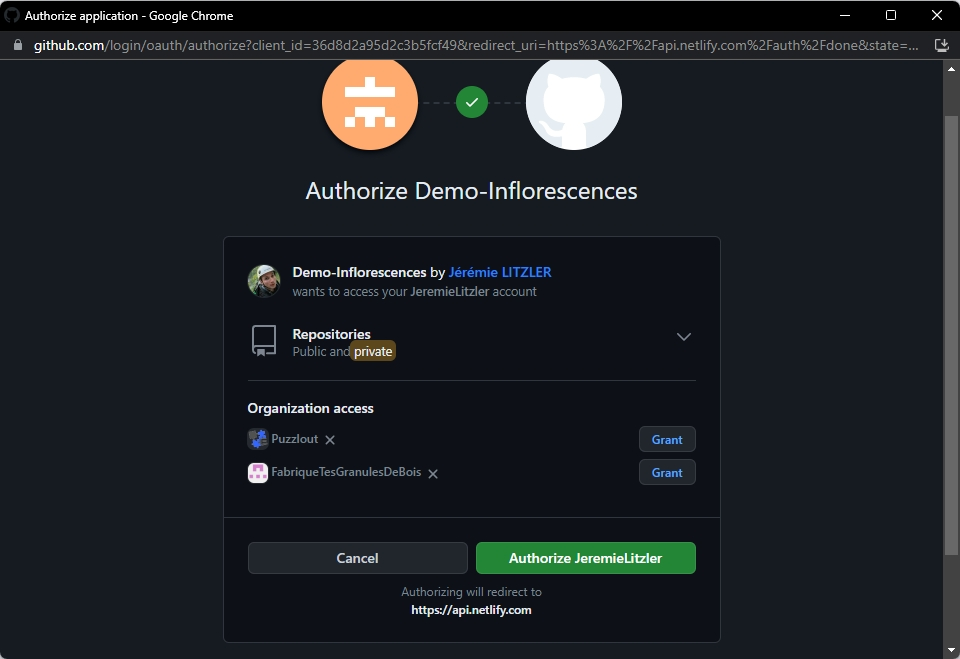

 de Snipcart.')

À la place d’une solution comme WordPress, NetlifyCMS permet de gérer son contenu sans les difficultés connues de WordPress.

<!-- more -->

## Activer NetlifyCMS

Par défaut, le modèle de site VuePress contient le dossier `admin`de base il faudra mettre à jour quelques éléments.

Les étapes sont assez simples :

1. Modifiez le fichier `config.yml`dans votre dépôt et le dossier `docs/.vuepress/public/admin` en mettant à jour la valeur du nom du dépôt GitHub.
2. Dans Netlify, rendez-vous dans `https://app.netlify.com/sites/votre-site/settings/general` dans le formulaire et cliquez `Identity`
3. Cliquez `Enable Identity`.
4. Modifiez-les `Registration preferences` pour permettre les souscriptions sans ou avec invitations. Par défaut, configurer `Invite only`.
5. Sans changer de page, descendez jusqu’à `Git Gateway` et cliquez `Enable Git Gateway`.
6. Passez sur GitHub une fois que vous êtes connectés sur votre compte : naviguer sur [https.://github.com/settings/developers](https://github.com/settings/developers) pour ajouter une L’URL d’autorisation dans le champ `OAuth App`.. Cliquez `New OAuth App`.
7. Fournissez dans le formulaire

- Le nom de l’application dans le champ `Application name`.
- L’URL de la page d’accueil de votre site dans le champ `Homepage URL`.
- La description publique de l’application dans le champ `Application description`.
- L’URL d’autorisation dans le champ `Authorization callback URL` avec la valeur `https://api.netlify.com/auth/done`.

8. Une fois validé, vous verrez le `Client ID`et le bouton pour générer le `Client Secret` via le bouton `Generate a new client secret`.
9. Cliquez le bouton pour générer le Client secret et copiez la valeur générée.
10. De retour sur Netlify, rendez-vous sur `Access Control`
11. Allez dans `OAuth` et cliquez `Install provider` en sélectionnant `GitHub`.
12. Saisissez le client secret copié à l’étape 9 et copiez-collez le client ID avant de cliquer `Install`.
13. Pour finir, rendez-vous sur `https://mon-super-domaine.fr/admin` et cliquez `Login with GitHub`.

:::warning Pour accéder à NetlifyCMS de votre site, soyez sûr de pouvoir vous connecter à GitHub.
:::

14. L’écran suivant s’affiche où il suffit de cliquer `Authorize VotrePseudoGitHub`.
    

15. Vous arrivez alors sur la page d’accueil de l’interface de gestion NetlifyCMS de votre site
    

## Limitations

- Il faut apprendre la syntaxe _Markdown_. Elle n’est pas très difficile à maitriser.
- Pour un blog de très grande taille (plus de 400 pages générées incluant les pseudos liens si vous utilisez les catégories et les tags), l’hébergement sur Netlify risque d’être limite.
  - Toutefois, l’astuce de déployer le dossier `dist` généré sur votre PC donne le même résultat.
  - Je ne l’ai toutefois pas encore testé.

À part ça, c’est tout d’après mon usage depuis août 2022.
