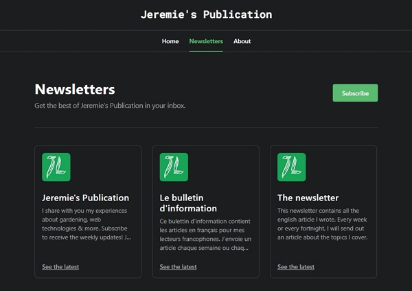
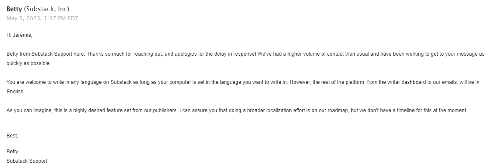

Regardons ensemble les étapes pour configurer votre publication afin que vous puissiez fournir du contenu en deux langues.

<!-- more -->

<!-- markdownlint-disable MD033 -->

<iframe class="newsletter-embed" src="https://iamjeremie.substack.com/embed" frameborder="0" scrolling="no"></iframe>

Lorsqu'il s'agit de créer votre newsletter, vous disposez d'un large choix de solutions.

J'ai choisi Substack en raison de ses valeurs : donner la priorité à ceux qui écrivent et fournir des outils efficaces pour les aider à développer leur base d'abonnés.

Cependant, lorsque vous parlez couramment 2 langues, il n'est pas simple de maintenir une newsletter dans deux langues.

Vous pourriez utiliser deux publications distinctes, mais j'avais écrit pas mal d'articles lorsque j'ai réalisé que je devais _ranger_ ma publication concernant le contenu bilingue.

De plus, certaines parties de la publication ne peuvent pas encore être traduites.

## L'anglais doit être la langue par défaut

Aujourd'hui, vous ne pouvez pas configurer tout le contenu dans votre langue préférée.

Ce qui suit sera en anglais, alors choisissez les valeurs avec soin :

- le nom de la publication,
- la description courte (elle peut inclure les deux langues, mais elle est limitée à 258 caractères…),
- les Catégories,
- le logo,
- la photo de couverture, affichée sur la page d'accueil,
- le design du site, qui couvre simplement la couleur principale, la mise en page et la police,
- les détails de la publication, avec votre nom, vos droits d'auteur et votre adresse postale.

En ce qui concerne les éléments suivants, nous les examinerons dans les paragraphes suivants :

- la page _À propos_,
- le mail de bienvenue,
- la navigation,
- les Sections,
- les paramètres de bannière, d'en-tête et de pied de page d'e-mail
- la page de désinscription des e-mails

## Configurer la page _À propos_

Je choisis d'écrire le contenu de cette page en deux langues.

Vous pouvez [le voir ici](https://iamjeremie.substack.com/about).

La configuration est simple : j'utilise `heading2` pour séparer le contenu de chaque langue.

J'ai ajouté un lien vers mon blog pour des informations plus détaillées, qui est, bien sûr, disponible en deux langues.

## Configuration des sections pour créer une newsletter par langue

Ensuite, nous allons créer les sections, également appelées _newsletters_ ou bulletins d'information.

Pour chacun, vous pouvez personnaliser :

- le titre
- la description
- le nom de l'expéditeur de l'e-mail, si votre nom défini ci-dessus dans les détails de la publication n'est pas adapté à la langue avec laquelle vous traitez.
- l'URL web de la rubrique/newsletter.
- le fait que vous souhaitiez masquer les publications sous cette rubrique depuis la page d'accueil.

> La sous-pile dit :
>
> > Si cette case est cochée, les publications de cette section n'apparaîtront pas sur la page d'accueil de votre publication ni sur les archives de la publication. Les messages apparaîtront toujours dans la page de la section.

- et un logo, si vous souhaitez qu'il soit différent du logo de la Publication.

## Configurer la navigation

Une fois les sections créées, vous pouvez ranger la navigation.

Je ne me souviens pas exactement de la valeur par défaut, mais vous aurez:

- la page d'accueil,
- la page Archives,
- la page _À propos_,
- chaque page _Section_,
- et la page Newsletters

Je cache la page Archive et les Sections (qui sont ajoutées automatiquement).

Cela vous donnera un résultat soigné:

## Configurer l'e-mail de bienvenue

De même, l'e-mail de bienvenue est écrit en utilisant `heading3` pour séparer les langues (`heading2` est utilisé pour le titre).

Ce qui est important ici, c'est la section que vous ajouterez pour expliquer au nouvel abonné comment activer les notificaitons de la publication ou sur un bulletin d'information sélectionné (peut-être que votre abonné ne parle que le français, par exemple).

Dans mon cas, je devrai écrire un message spécial à mes abonnés français actuels pour les aider à s'abonner à la newsletter en français uniquement.

## Configurer l'e-mail de bienvenue dans les deux langues

Il est maintenant temps de configurer l'e-mail de bienvenue.

Pour ce faire, nous devions configurer les sections, car, dans mon cas, j'ai inclus les liens de chaque section dans le bloc de langue respectif de l'e-mail.

Ici [mon email de bienvenue](./welcome-email.md).

## Configurer l'e-mail de désinscription dans les deux langues

Tout comme vous l'avez fait pour l'e-mail de bienvenue, vous utiliserez les mêmes techniques pour définir le contenu bilingue sur l'e-mail de désinscription.

## Le faites-vous différemment

Faites-le moi savoir dans le commentaire!

J'ai demandé à Substack quand ils auront le support complet pour les langues dont nous avons besoin.

Voici leur réponse :

Soyons patients et espérons une sortie prochainement !

:::centre
⏬⏬⏬
:::

<!-- markdownlint-disable MD033 -->

<iframe class="newsletter-embed" src="https://iamjeremie.substack.com/embed" frameborder="0" scrolling="no"></iframe>

