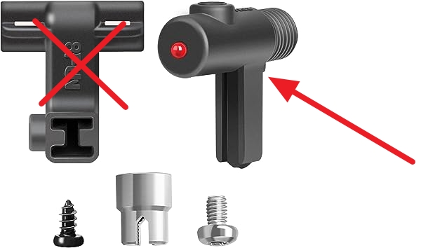
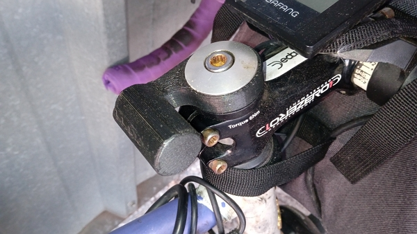
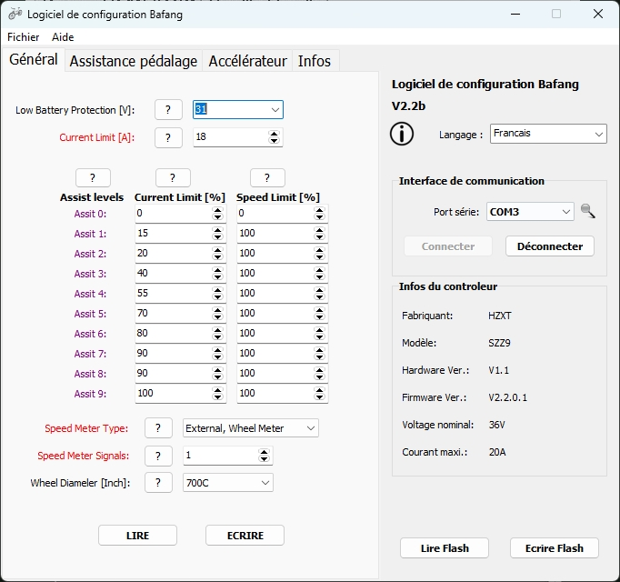
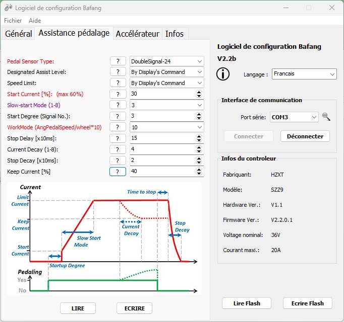

Voilà plus de 5 ans que je roule en VAE, au début sur une base de Scott CX COMP, puis sur un Raleigh Brazil. Je vous explique le pourquoi, comment et mon ressenti.

<!-- more -->

## Pourquoi et quand

Au printemps 2018, la SNCF subit une grève majeure qui [lui coûtera 890 millions d’euros](https://www.google.com/search?q=gr%C3%A8ve+scnf+printemps+2018).

Pour moi, ça a été le déclic. Je prenais pourtant juste un trajet de 10 min de Tain-l’Hermitage à Valence Ville en mode « vélo-train » et pourtant, le fait d’avoir des retards supérieurs à 30 min ou même 1 heure (ou même de train du tout) n’était pas des plus sympa.

Je ne pouvais pas non plus faire l’aller-retour chaque jour de mon domicile au bureau (21 km aller), car, dans la vallée du Rhône, ça souffle souvent.

Du coup, je me suis penché sur l’acquisition d’un VAE (Vélo à Assistance Électrique) pour réaliser les trajets journaliers au travail en vélo.

Jusqu’en 2015 (naissance de mes filles), je le réalisais sur mon cyclocross Scott CX Comp de 2011, mais j’avoue que j’avais besoin d’énergie en fin de journée…

## Comment

J’ai très vite choisi de me concentrer sur l’option _Kit VAE à monter sur vélo musculaire_.

Pourquoi ?

1. je voulais garder la possibilité de transformer le vélo du VAE au musculaire, si le kit VAE venait à ne pas être fiable.
2. je n’avais pas les finances d’acheter un VAE typé route. En 2018, le choix était limité.
3. j’avais un budget de 1200 euros environ

Mon choix s’est orienté vers le kit Bafang fabriqué en Chine, revendu en France pour des revendeurs comme Cycloboost ou OZO électrique.

J’ai échangé pendant 2 mois (mars 2018 à avril 2018) afin de m’assurer si le kit était compatible avec mon vélo cyclocross, qui est typé « route » et donc la géométrie du cadre et les dimensions n’étaient pas exactement les mêmes qu’un VTC ou un VTT classique.

J’ai posé des questions sur le fait d’utiliser un kit avec un moteur de 500 W. Toutefois, hors chemin privé, il n’est pas possible de rouler ==_légalement_== sur la route publique avec un vélo d’une puissance de plus de 250W assisté électriquement.

J’ai demandé :

> Concernant les kits supérieurs à 250 w, il est donc illégal de rouler avec sur les routes publiques. Si contrôle il y a (de vérification, pas de contravention), qu’est-ce que la loi prévoit.

La réponse de Cycloboost fut :

> Vous avez raison, la norme en vigueur prévoit une limite de puissance à 250W soit une assistance jusqu’à 25 km/h.
>
> Bon nombre de nos clients passent cependant le pat et décident de passer sur des puissances supérieures.
>
> Le client prend alors la responsabilité d’utiliser un kit plus puissant que la norme, à lui d’utiliser son kit en bonne intelligence et d’adapter sa conduite en fonction de son environnement.
>
> À ce jour, nous n’avons eu aucun retour client concernant des contrôles de vérification ou même de contravention.
>
> Je ne peux malheureusement pas vous dire quelles sont les sanctions encourues.

J’ai décidé de ne pas prendre le risque.

### Ma commande initiale

J’ai commandé le kit suivant :

- 1 x BBS01 B — 36 v 250 w/540 w — Kit moteur pédalier 8FUN
- 1 x BBS — Écran LCD C965
  - avec le réglage de l’écran LCD, pour une jante de 28"
- 1 x plateau BBS 01/02 44 dents avec protège-plateau
- 1 x Batterie Trapèze de 36 v à 10,5 Ah avec chargeur et cellules LG 18650-MJ1
- une platine pour Batterie Trapèze avec un câble d’alimentation de 10 cm Outil de montage
- 1 x Outil montage pour moteur Bafang BBS01/02/HD
- 1 x Pack de montage pour une finition parfaite
- sans Option freins à coupure électrique
- sans Option accélérateur au pouce ou à la poignée, **car non légale sur la voie publique**

Le tout m’a coûté 1143 euros.

## Retour d’expérience

### Montage

Dès réception du colis, je suis hâté de monter le kit sur mon vélo Scoot CX Comp.

L’installation du moteur fut plutôt simple et rapide, ce ne fut pas le cas pour :

- le capteur de vitesse sur le hauban arrière
- la commande d’assistance
- la fixation de la batterie sur le tube descendant

J’ai échangé longuement avec Cycloboost sur ces trois éléments du kit et je pense que j’étais un des premiers cyclistes équipant un vélo de route avec le kit.

**Pour le capteur de vitesse**, il est livré avec l’aimant, une pièce avec la LED, à laquelle est connecté le câble et la patte qui sert de support entre le vélo et la pièce avec la LED.

Après m’être assuré que je pouvais le faire, j’ai coupé la pièce avec la LED au niveau où pointe la flèche rouge sur l’image pour donner ce qui suit :

J’ai ensuite fixé le capteur avec 3 colliers de serrage, en 37 000 km, je dois avouer que ça convient très bien.

**Pour la commande d’assistance**, Cycloboost m’a envoyé une pièce en plastique construite avec une imprimante 3D pour un anneau permettant de serrer la potence à la fourche.

J’ai utilisé cela uniquement avec le Scott. Avec le Raleigh, j’ai préféré l’installer avec un collier de serrage et la guidoline, car cela permet d’ajuster l’assistance sans lever la main du guidon.

**Pour la batterie**, j’ai aussi reçu une pièce supplémentaire (qu’il proposent en 2023) en aluminium usinée. Il s’agit d’une platine secondaire qui me permet d’installer la batterie assez haut sur le tube pour faire passer le câble à la base du tube de selle et du tube inférieur.

Sur les vélos de route, les trous pour fixer la gourde sont plus bas qu’un VTC ou VTT. La platine se fixe sur les filetages existants et la batterie se fixe ensuite sur les trous filetés restants.

Le problème au bout de 1200 km fut le suivant : les vibrations de 40 km parcourus journalièrement ont affaibli les soudures des trous filetés sur le cas.

J’ai résolu le problème avec des supports « maison » en thermoplastique que j’utilise pour réaliser des pièces uniques « façon pâte à modeler » (il s’agit de billes plastiques qui fondent dans l’eau bouillante et se rigidifient à température ambiante).

### 11 800 km et le contrôleur « grille »

Ce fut mon premier et seul gros souci.

Je rentre un soir et dans la côte de 700 m qui mène chez moi, le moteur perd 90 % de sa puissance et un bruit d’engrenage pas très content se fait entendre.

Je fais une vidéo et j’envoie cela directement à Cycloboost.

J’accepte l’offre de diagnostic après avoir payé 27 euros d’envoi…

Ils me disent :

> Vous avez grillé le contrôleur et les roulements…

Ils ajoutent que le fait de tirer la remorque sur la montée 1 à 2 fois par semaine depuis 1 an et demi est le problème…

Je me renseigne et je découvre qu’en réalité, il faut aussi entretenir le moteur et regraisser les roulements tous les 6000 km…

Après une vive discussion par message interposé sur leur site (en effet, la hotline téléphonique n’est pas trop disponible…), on se met d’accord que le partage des frais : ils prennent en charge la main-d’œuvre, je paye les pièces à remplacer.

Ça me coûtera un peu plus de 155 euros en plus des 27 euros de colis.

À partir de ce moment-là, j’ai recherché plus précisément comment réaliser l’entretien du moteur.

Depuis ce mois de septembre-octobre 2019, je réalise mon propre entretien et je n’ai pas « grillé » d’autres contrôleurs…

## Les usures

### Filetage de l’axe de pédalier

Si vous souhaitez, comme moi au début, garder l’option de pouvoir transformer le vélo du VAE au vélo musculaire, vous pouvez oublier.

En effet, le premier souci d’usure dont je me souviens est apparu sur lire sur le filetage de l’axe sur lequel on installe le boitier de pédalier.

Ce n’est pas immédiat, mais dès que j’ai appris qu’il fallait entretenir le moteur tous les 6000 km, j’ai remarqué cette usure sur le Scott.

C’est à ce moment que j’ai arrêté d’utiliser le kit VAE sur ce vélo et je l’ai revendu en vélo musculaire plusieurs mois après.

### Câbles internes

Après un troisième démontage, j’ai eu la surprise d’avoir un souci de puissance sur le second moteur.

La cause : je pense qu’il s’agit des 3 câbles reliant le moteur au contrôleur…

Pour entretenir le moteur, il faut démonter ces câbles, solidement fixés avec du silicone pour l’étanchéité, afin d’accéder aux roulements du moteur.

Et il faut ensuite retirer de multiples petites pièces plastiques qui garantissent l’étanchéité. Je pense que le problème vient de là.

En démontant le moteur, on tire dessus et la gaine casse…

Je vais sûrement essayer de remplacer ces câbles, mais je ne suis pas sûr du résultat.

Au pire, j’ai des roulements et des pièces de rechange.

Toutefois, j’aimerais éviter qu’un moteur soit hors service au bout de 18 000 km.

### Les batteries

J’ai acheté une seconde batterie en période de promotion 1 an après l’achat initial, avec un chargeur et une platine (dont j’aurai pu me passer).

À ce jour (24/07/2023), je suis à 239 cycles de 380 Wh sur chaque batterie (j’utilise chacune un jour sur deux).

J’ai remarqué l’hiver 2021-2022 que j’arrivais difficilement à faire l’aller-retour avec une charge.

En lisant sur le sujet, le froid n’est pas trop l’ami des batteries et j’ai donc investi dans une Housse néoprène pour batterie de cadre, [disponible sur OZO Électrique](https://ozo-electric.com/fr/accessoires-pour-batteries/787-housse-neoprene-pour-batterie-de-cadre.html).

Cela a permis de gagner un peu d’autonomie, mais je pense que le mal est fait : j’ai sûrement perdu de l’autonomie les hivers 2018-2019, 2019-2020 et 2020-2021…

:::note Un des plus de la housse

Elle permet de prévenir l’intrusion de l’eau entre la batterie et la platine, ce qui posait problème en cas de forte averse !

:::

En 2020, j’ai contacté Cycloboost, qui m’a dit :

> Impossible de remplacer les cellules des batteries de 2018…

Et comme les nouvelles batteries trapèze utilisent un nouveau format de platine de batterie, impossible d’acheter juste la batterie… J’en ai fait l’expérience.

Toutefois, je ne perds pas espoir, j’ai rencontré quelqu’un, propriétaire d’un vélo cargo Reise & Muller, qui m’a donné le contact de quelqu’un. Il semble qu’il puisse remplacer les cellules usagées. Je dois le contacter pour obtenir un devis pour une batterie.

En attente, j’ai une batterie « PVC » 36V de Cycloboost. Avec ça, pas de risque d’incompatibilité de platine.

Avec une sacoche de stockage (cadeau en geste commercial vu qu’ils ne m’ont pas dit que le format de platine avait changé entre 2018 et 2022) qui se fixe au cadre, j’ai une option pour le jour où les batteries trapèze seront trop faibles.

## Usage

### Avis après 37 000 km d’utilisation

Ça fonctionne bien !

Pas de fatigue en faisant l’aller-retour tous les jours depuis juin 2018.

Même avec du vent de face de 30-40 km/h et des rafales à 60 km/h (expérience en vallée du Rhône), je rentre sans être épuisé à cause du trajet (au contraire, cela fait du bien :)).

Il ne faut pas rêver par contre : il faut mettre un bon coup de pédale avec un vent pareil !

Je me mets sur le niveau 5 sur 5 et la moyenne est de 25,6 km/h pour une limitation à 27 km/h (25 km/h + 10 %).

### Programmation optimisée

Mon épouse avait un vélo équipé d’un moteur Bosch Active en 2019 et la différence entre les 2 moteurs à ce moment-là était flagrante.

Toutefois, après avoir installé mon second moteur, fin de l’été 2020, j’ai appris davantage.

Le moteur original avait été programmé par Cycloboost et j’avais l’impression d’avoir un effet _mobilette_ par moment.

Quand j’ai installé le second moteur, j’ai tout de suite remarqué que la montée vers chez moi était bien moins assistée.

Après quelles recherches, j’ai trouvé le site Blitip avec cet article « [Premiers essais et paramétrage du contrôleur Bafang](https://blitip.blogspot.com/2019/04/premiers-essais-et-parametrage-du.html) ».

Il fournit des instructions en français sur la programmation du moteur, et pas que la limite d’assistance ;)

Sur [l’article anglais « A Hacker’s Guide To Programming The BBS02 & BBSHD »](https://electricbike-blog.com/2015/06/26/a-hackers-guide-to-programming-the-bbs02/) qu’il cite, on trouve plus de précisions que je résumerai ainsi :

1. débrancher la batterie du moteur
2. brancher le câble de programmation au port vert
3. connecter le câble de programmation au PC
4. rebrancher la batterie au moteur
5. lire et programmer le contrôleur

6. débrancher la batterie du moteur
7. débrancher le câble de programmation du PC
8. rebrancher la batterie au moteur

Les exemples ci-dessus sont valables pour un moteur 250 W avec une batterie de 36 V.

J’ai toutefois configuré il y a 2 ans un peu différemment et j’avais bien plus de « punch » en montée ou contre le vent.

Il faut que je retrouve la configuration pour cela, mais avec cette configuration, j’ai une meilleure sensation d’assistance, plus proche de celle de Bosch, sans être égale.

Vous pouvez aussi visionner [une vidéo (en anglais) sur le sujet](Video: https://www.youtube.com/watch?v=Cy2RFpWLeZ4).

### Entretien régulier

Tous les 200 heures ou environ 6000 km, je démonte entièrement le moteur.

Cela me prend environ 1 h 30 une fois le moteur déposé.

Le démontage du moteur du vélo et son remontage prennent une bonne heure.

## Conclusion

Je ne retournerai pas en arrière :D

L’investissement en vaut la chandelle.

Je ne prends presque plus la voiture pour les courses de nourriture grâce à l’installation de porte-bagage et de 2 sacoches de 25 litres en plus de mon sac à dos de 32 litres.

A 12 centimes le kilomètre (`[coût total d’achat, d’entretien et de carburant]/[kilomètres parcourus en voiture]), 34 000 km équivalent à 4440 euros et je suis loin de cela.

En tout, hors vêtement, pièces de rechange comme les pneus, dérailleurs, chaînes et accessoires dont j’aurai eu besoin en vélo-train, j’ai dépensé :

- 1142 euros initiaux
- 183 euros de réparation du premier moteur
- 411 euros de seconde batterie
- 378 euros pour la batterie PVC et sacoche
- 301 euros pour le second moteur
- 308 euros pour le troisième moteur
- une centaine d’euros de pièces de rechange Bafang (joint, roulements, etc.)

Soit un total de 2823 euros.

On peut dire que ça vaut le coup.

De plus, je ne parle pas des bienfaits pour la santé et cela, ça ne se chiffre pas…

### Me contacter sur le sujet

C’est [par là](../../../page/contactez-moi/README.md) ou dans le menu « Contact » dans le menu du site.

Merci.
