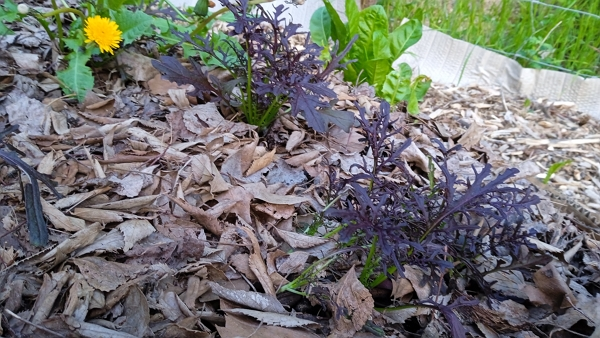
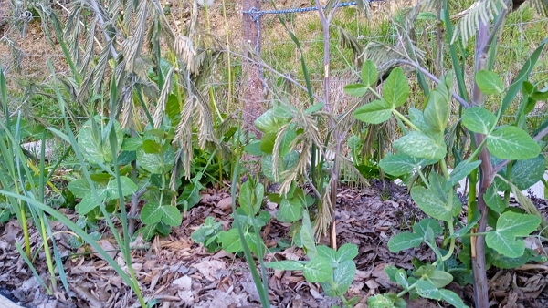
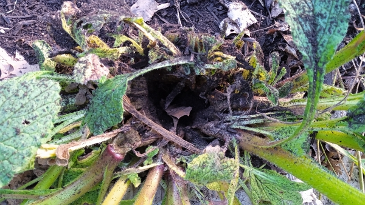
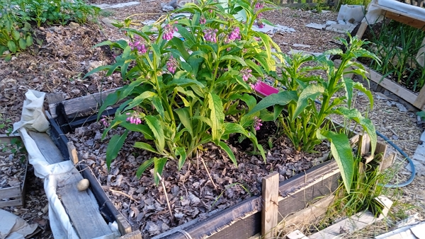
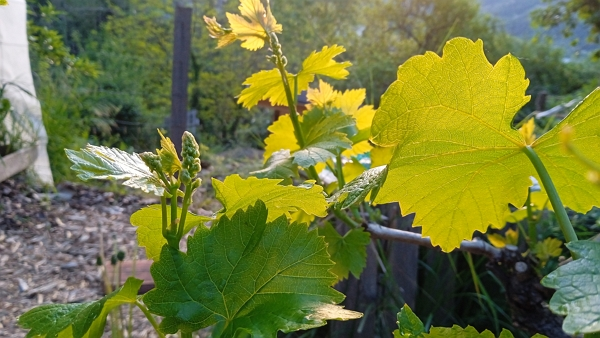
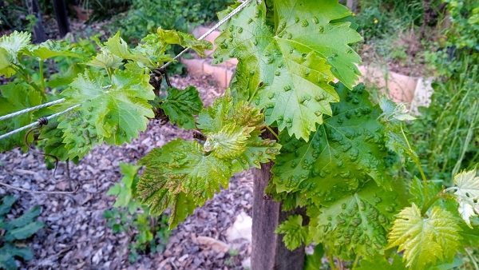
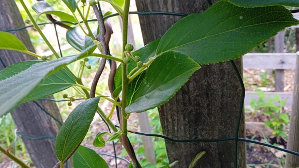
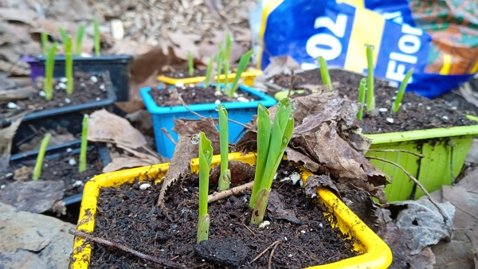
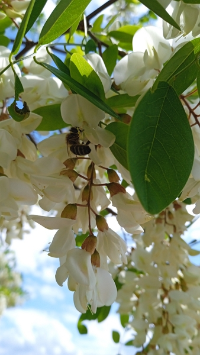

[< Retour à la table des matières](./README.md) <!--| [Revenir à mars](2023-03.md) | [Aller à mai >](2023-05.md)-->

## 30 Avril

À l’entrée du jardin, après avoir monté le chemin de dalle, on remarque les progrès des salades rouge mesclun. Elles ne montrent pas toute la même vitalité, mais il y aura de quoi manger. Les salades _quatre saisons_ résistent malgré le début difficile après le transplantage compliqué.

Du côté ail, on trouve un petit peu de tout : il y a des petits, il y a des gros. Pourtant je les ai plantés en même temps. Mais bon, on mangera sûrement beaucoup d’ail vert avant le début de l’été.

Les pois mangetout s’accrochent enfin aux branches de mimosa. Les branches font office de tuteurs.

Hier, j’ai récolté entièrement deux gros pissenlits, pour les manger crus en salade.

J’ai vu deux supers papillons. Il s’agit de l’espèce Empereur.

')

La bourrache, proche des pommes de terre, est énorme. Elle est tellement grosse à la base qu’on y observe un puits, comme si la plante l’utilisait pour accumuler l’eau de pluie.

Avec les filles, on a coupé la moitié des tiges parce qu’on avait besoin de l’espace pour planter les haricots à rame de couleur verte. On a aussi planté une ligne de haricots grimpants de couleur jaune.

Au passage, on a ramassé les pommes de terre qui étaient sur le chemin où nous avons creusé la tranchée pour ces haricots.

Nous avons utilisé la technique suivante pour le semis des haricots :

- une fois les pommes de terre et la bourrache retirées,
- nous avons creusé une tranchée de 5 cm de profond dans un sol riche en vie (insectes, vers) et de matière carbonée (feuilles, écorces de douglas).
- les filles ont disposé une graine tous les 3-4 cm. Il y a 2 ans, on en avait mis 3 dans des trous individuels et cela avait trop donné.
- nous avons _inondé_ d’eau chaque tranchée (l’eau a été rapidement absorbée)
- nous avons terminé en recouvrant de composte noir que j’achète chez la carrière Roffat à Tain-l’Hermitage. Cela permettra de protéger les haricots des limaces opportunistes.

Vu que l’eau arrivait à 6 bars dans le tuyau d’arrosage, on en a profité pour arroser tout le jardin accessible avec le tuyau.

Les patates dans le carré poussent bien.

La consoude aussi. Elle est envahie de pollinisateurs, principalement des bourdons.

L’échinacée sous la consoude s’en sort. Elle se fait un petit peu manger par les limaces, mais je pense que par rapport aux deux dernières années, c’est moins grave.

Ensuite, juste en face, dans le lit d’ail, les salades _4 saisons_ ne sont pas fameuses.

En continuant vers la vieille vigne, on remarque que chaque branche supporte une à trois grappes en formation. Donc s’il n’y a pas de maladie, ça pourrait être sympa à la récolte de cette année.

Le cerisier est toujours aussi beau, même si le feuillage présente des taches rouges. Signe de maladie ? À suivre.

Les pastèques sont toutes sorties. Youhou ! La première culture avait donné d’énormes fruits. Ces plants sont issus de graines de la récolte d’il y a 3 ans.

La vigne qui s’est plantée toute seule indique des signes de maladie.

Du côté des groseilliers maquereau, framboisiers et autres cassis, tout le monde se porte bien. Le petit lit de feuilles mortes permet de garder l’humidité pour le moment.

Au niveau des fèves, on vient de ramasser une grosse quantité (870 g) de fèves. Les plants montent bien haut, à la taille des jumelles, soit environ 1 mètre 25.

Là où on plante en général les tomates, sous la sorte de pergola, on a décidé de planter une ligne de haricots jaunes grimpants. On a ramassé l’ail, un peu jeune certes, mais qui étaient sur le chemin.

Au passage, on a les carottes qui sont toujours en train de pousser entre les oignons à côté du petit kiwaï.

Le grand kiwaï, lui, développe plusieurs centaines de fleurs. Un truc de fou. Je crois que je vais peut-être pouvoir enlever la protection contre le froid.

On a de beaux plants de fraises, riches en fleurs.

Les kiwis vont avoir des fleurs. Mais en ce qui concerne les fruits, c’est une autre question.

À côté des fèves, on trouve aussi une énorme bourrache avec beaucoup d’abeilles, qui s’en donnent à cœur joie.

Au niveau de la surface libérée par la destruction de la dépendance, il y a encore beaucoup de travail à faire puisqu’il faut remblayer de composte.

Donc cela nécessitera au moins une quinzaine de remorques.

Une fois que cela est réalisé, la discussion du quoi planté sera complexe : pelouse pour madame, nourriture pour monsieur. À suivre… ;)

Nous avons aussi transplanté 6 petits chênes récupérés sous le chêne dans le jardin. Le but du moment présent est de créer des poteaux pour une future pergola de plus de 5 m, ainsi, pas besoin de permis de construire ;)

Tout le maïs est sorti alors ils poussent tous.

Je n’aurais jamais pensé que ça pousse aussi bien, en plus 2 ans après la récolte. Que la nature fonctionne merveilleusement bien !

L’abricotier ajoute des branches, mais aucune fleur. On l’a planté il y a moins de trois ans, donc il a le temps.

Le petit pommier, à la qu’on forme pour ne pas prendre de place sur l’allée menant à la maison, grandit très bien. Il présentait quelques feuilles recroquevillées, un peu comme celui qui est à côté des cassis et des groseilliers. Toutefois, cela semble s’être calmé.

Les arbrisseaux en pot, il y a un pêcher, deux pommiers et deux abricotiers se portent bien. Ils possèdent tous de belles feuilles, mais il faudra pour oublier de les arroser.

Pour finir, j’ai planté le cactus, acheté à la Grange pour Aurélie, entre le rhododendron et la menthe saoudienne.

Ah oui, le petit amandier extrait du composte survit. Je l’ai mis à l’ombre du rosier, car le soleil tape fort aujourd’hui.

[< Retour à la table des matières](./README.md) <! --| [Revenir à mars](2023-03.md) | [Aller à mai >](2023-05.md)-->
