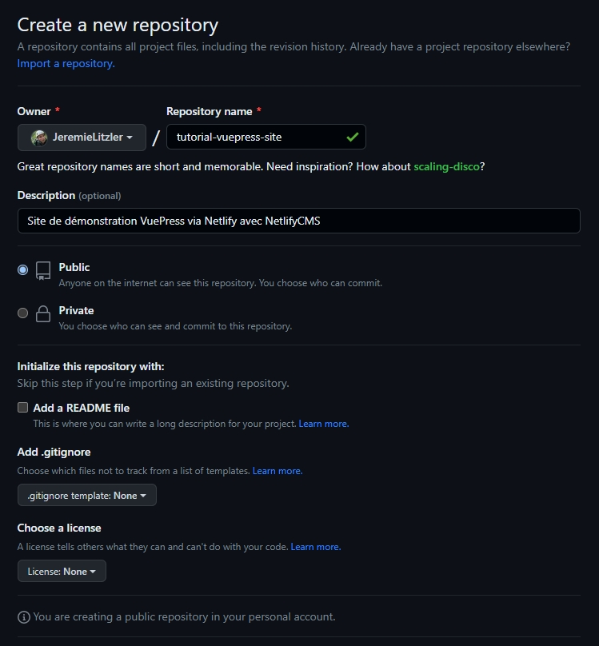
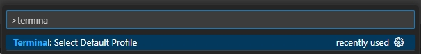
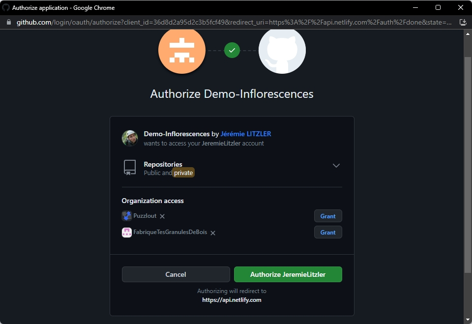

 de Snipcart.")

De nos jours, il existe beaucoup de méthodes pour créer son site web. J'en présente une qui coûte presque rien. Pour de vrai !

<!-- more -->

## Pré-requis

- Un ordinateur personel avec :
  - Windows 10 ou 11,
  - 8 Go LPDDR4,
  - un disque de 256 Go SSD
  - et un processeur Intel Celeron J4125 Quad Core (jusqu'à 2,7 GHz)
- Un compte e-mail (Google ou autre)
- Un compte GitHub (créé avec votre compte e-mail)
- Un compte Netlify (lié à votre compte GitHub)
- Un compte chez un registar pour le nom de domaine, si vous souhaitez une URL 100% personnalisée.

:::tip Par défaut, Netlify fournit une URL
Le sous domaine est configurable, sous réserve de disponibilité.

L'application serait alors disponible sous `https://mon-site.netlify.app`.
:::

## Les étapes

### Créer le dépôt sur GitHub

Une fois que vous avez à disposition tous les pré-requis, on commence par créer le dépôt depuis votre compte GitHub.

Pour cela, connectez-vous à votre compte GitHub et :

1. Rendez-vous sur [https://github.com/new](https://github.com/new).
2. Remplissez les champs :

- `Repository name`
- `Description`
- Choisissez le visibilité : `Public` ou `Private`.
- Ignorez la suite qui sera copié du modèle



3. Cliquez `Create repository`

### Préparer le poste de développement

Une fois que le dépôt est prêt, je vous invite à préparer votre poste de développement.

Il faut :

- Installer [Git bash](https://git-scm.com/downloads) en cliquant suivant (aucune personnalisation n'est nécessaire).
- Installer [NodeJS 18.5.0](https://nodejs.org/en/blog/release/v18.5.0/) en cliquant suivant (aucune personnalisation n'est nécessaire).
- Installer [Visual Studio Code](https://code.visualstudio.com/download) en cliquant suivant (aucune personnalisation n'est nécessaire).
- Lancer Visual Studio Code et tapez `CTRL+SHIFT+P` puis `Terminal` pour sélectionner le profil `Git Bash`
  
  Et :
  

- Tapez `CTRL+ù` pour ouvrir le terminal avec `Git Bash`

- Vous êtes prêts à cloner les dépôts :

  - Optionnellement, créer un dossier `Git` dans le disque C ou D de votre ordinateur.
  - Lancer la commande `git clone https://github.com/VotrePseudoGitHub/NomDeVotreDepot` qui crée un dossier `NomDeVotreDepot`.
  - Lancer la commande `git clone https://github.com/Puzzlout/TemplateVuepress/` pour clôner le dépôt contenant la structure du site à réaliser. Le dépôt est sauvegardé dans le dossier `TemplateVuepress`.

### Initialiser le site web à partir du modèle

Maintenant que les dépôts sont clonés :

- Copier le tout le contenu du dossier `TemplateVuepress` dans le dossier `NomDeVotreDepot`, incluant le dossier `.vscode` pour les snippets de code.

:::warning Ne copier pas le dossier .git
:::

:::tip Comment voir le dossier .vscode s'il n'apparait pas ?

- Ouvrez l'explorateur de fichiers et sélectionner le menu `Options` comme indiqué ci-dessous :
  

- Sélectionnez l'affichage des dossiers et fichiers cachés :
  

:::

- Modifier au minimum les fichiers suivants pour personnaliser votre site.

:::warning A TERMINER

:::

Je ne détaillerai pas comment créer votre site, car cela dépend beaucoup de votre besoin.

Voici les exemples de sites :

- le présent site, où vous vous trouvez, est créé avec le modèle (en fait, il a servi de base pour le modèle).
- le site de mon activité de microentreprise : [www.puzzlout.com](https://www.puzzlout.com).
- le site d'une productrice de quinoa que j'ai réalisé au premier semestre 2023 : [www.inflorescences-quinoa.fr/](https://www.inflorescences-quinoa.fr/)
- le site de la méthode _Passons le C.A.P_ : [wwww.passonslecap.fr](http://passonslecap.fr/)

Pour des conseils et des besoins particuliers, [contactez-moi](../../page/contactez-moi/README.md).

### Déployer le site sur Netlify

Maintenant que le contenu est prêt :

1. Lancer le terminal avec `CTRL+ù`, s'il n'est pas déjà ouvert.
2. Lancer la commande suivante :

```sh
git add -A && git commit "pousser le contenu sur GitHub" && git push
```

3. Rendez-vous sur [app.netlify.com]

### Commande le domaine personnalisé

### Mettre à jour l'application sur Netlify avec un domaine personnalisé

Une fois que le domaine est provisionné, il faut paramétrer Netlify pour que le site web pointe sur le domaine.

Pour un domaine de base, il y a 3 actions :

- supprimer les entrées DNS `A` sur le domaine `mon-domaine.fr` et `wwww.mon-domaine.fr`.

:::warning Sur OVH...
J'ai eu une fois un temps de propagation de la suppression de l'entrée `A` sur le sous-domaine `www` qui a pris plus dizaines de minutes.

Soyez patients ;)
:::

- ajouter le domaine dans Netlify en sélectionnant votre site depuis [app.netlify.com](https://app.netlify.com), puis en cliquant `Domain settings`.
  - dans `Production domains`, cliquer `Add domain` et confirmer l'ajout sans passer par `Netlify DNS`

:::warning Netlify DNS

Vous verrez sûrement l'alerte suivante :

> .fr domains can’t be registered through Netlify.
> You can still add mon-site.fr to your Netlify site if you already own the domain. Select Add domain to add it to your site. You can configure Netlify DNS for this domain later.

Cliquer `Add domain` ou `Add subdomain` quand même.
:::

- une fois sur l'écran ci-dessous, cliquez `Awaiting External DNS` et suivez les instructions :
  

  - pour un domaine _racine_,
    - ajouter l'entrée `A` en utilisant l'adresse IP du loadbalancer que Netlify vous fournit.
    - ajouter l'entrée `CNAME` en utilisant le DNS que Netlify vous fournit.
      
  - pour un sous domaine,
    - vous aurez seulement l'entrée `CNAME` à ajouter.

- rendez vous sur votre registar (ex : OVH) et dans la section `Domain > mon-site.fr > DNS Zone`, sélectionner `Ajouter un entrée` et le type selon votre besoin.

  - pour une entrée `CNAME`, ça ressemble à ceci :

  - confirmez et attendez quelques minutes (voire plus si votre registar est lent)
  - rafraichissez la page sur Netlify : quand tout est bon, le message `Awaiting external DNS` doit avoir disparu.
  - Netlify provisionne ensuite un certificat _Let's encrypt_ automatiquement pour vous.

:::warning Temps de provisionnement du certificat HTTPS
Cela prend un peu plus de temps sur un domaine racine qu'un sous-domaine seulement.
:::

### Activer NetlifyCMS

Par défaut, le modèle de site VuePress contient le dossier `admin` de base il faudra mettre à jour quelques éléments.

Les étapes sont assez simples :

1. Modifier le fichier `config.yml` dans votre dépôt et le dossier `docs/.vuepress/public/admin` en mettant à jour la valeur du nom du dépôt GitHub.
2. Dans Netlify, rendez-vous dans `https://app.netlify.com/sites/votre-site/settings/general` dans le formulaire et cliquez `Identity`
3. Cliquer `Enable Identity`.
4. Modifier les `Registration preferences` pour permettre les souscriptions sans ou avec invitations. Par défaut, configurer `Invite only`.
5. Sans changer de page, descendez jusqu'à `Git Gateway` et cliquez `Enable Git Gateway`.
6. Passer sur GitHub une fois que vous êtes connectés sur votre compte : naviguer sur [https.://github.com/settings/developers](https://github.com/settings/developers) pour ajouter une L'URL d'autorisation dans le champplication `OAuth App`.. Cliquez `New OAuth App`.
7. Fournissez dans le formulaire

- Le nom de l'application dans le champ `Application name`.
- L'URL de la page d'accueil de votre site dans le champ `Homepage URL`.
- La description publique de l'application dans le champ `Application description`.
- L'URL d'autorisation dans le champ `Authorization callback URL` avec la valeur `https://api.netlify.com/auth/done`.

8. Une fois validé, vous verrez le `Client ID` et le bouton pour générer le `Client Secret` via le bouton `Generate a new client secret`.
9. Cliquez le bouton pour générer le Client secret et copiez la valeur générée.
10. De retour sur Netlify, rendez vous sur `Access Control`
11. Allez dans `OAuth` et cliquez `Install provider` en sélectionnant `GitHub`.
12. Saisissez le client secret copié à l'étape 9 et copiez-collez le client ID avant de cliquer `Install`.
13. Pour finir, rendez-vous sur `mon-site.fr/admin` et cliquez `Login with GitHub`.

:::warning Pour accèder à NetlifyCMS de votre site, soyez sûr de pouvoir vous connecter à GitHub.
:::

14. L'écran suivant s'affiche où il suffit de cliquer `Authorize VotrePseudoGitHub`.
    

15. Vous arrivez alors sur la page d'accueil de l'interface de gestion NetlifyCMS de votre site
    

## Limitations

- Il faut apprendre la syntaxe _Markdown_. Elle n'est pas très difficile à maitriser.
- Pour un blog de très grande taille (plus de 400 pages générées incluant les pseudos liens si vous utilisez les catégories et les tags), l'hébergement sur Netlify risque d'être limite.
  - Toutefois, l'astuce de déployer le dossier `dist` généré sur votre PC donne le même résultat.
  - Je ne l'ai toutefois pas encore testé.

A part ça, c'est tout d'après mon usage depuis août 2022.
